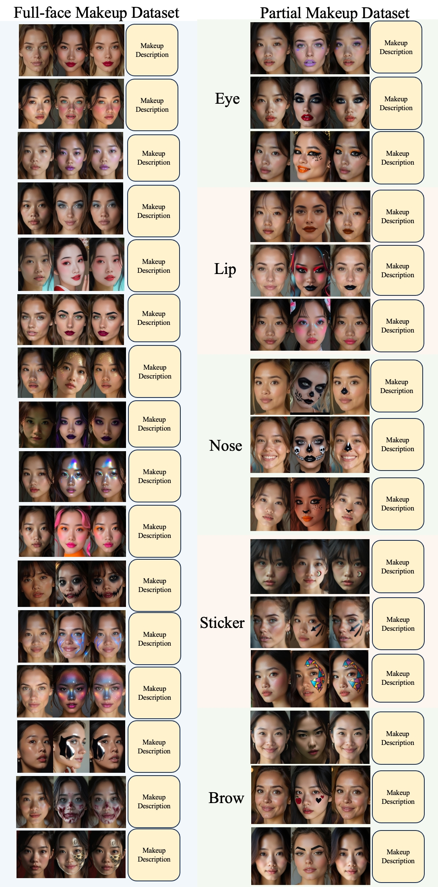

# EvoMakeup: High-Fidelity and Controllable Makeup Editing with MakeupQuad
<div align="center">

[](https://arxiv.org/abs/2508.05994)&nbsp;
[](https://github.com/ByteVisionLab/EvoMakeup)&nbsp;

</div>


## 🔥 Introduction 

We introduce **MakeupQuad**, a large-scale, high-quality dataset containing non-makeup faces, reference images, edited results, and detailed makeup descriptions. Building on this dataset, we propose **EvoMakeup**, a unified training framework that tackles image degradation during multi-stage distillation and iteratively improves both data and model quality. Even though EvoMakeup is trained solely on synthetic data, it generalizes well and outperforms previous methods on real-world benchmarks.


<div align='center'>

<p><b>Figure 1:</b> Top: Comparison with prior methods. Evo-Makeup faithfully preserves both makeup and identity, while SHMT-h0, SHMT-h4, and Stable Makeup exhibit degraded makeup quality or identity loss. Bottom: MakeupQuad, the first quadruplet-based dataset, supports full-face and partial makeup editing with high identity and makeup consistency. It enables disentangled learning and supports EvoMakeup’s high-fidelity results. </p>
</div>


## 🌿 Overview of the MakeupQuad construction pipeline and the EvoMakeup training framework
Left: Coarse full-face makeup quadruplets are built using GPT-4v-generated descriptions, identity-varied no-makeup images from FLUX, SeedEdit-based editing, and inpainting to create reference images with consistent makeup but different identities. Middle: A full-face makeup editing model trained on the above coarse dataset generates partial makeup results. A limited set of high-quality region-specific quadruplets are selected through a series of filters, including an MLLM-based strategy, to fine-tune partial editing models that synthesize large-scale coarse partial quadruplets. Right: The EvoMakeup framework iteratively refines both model and data based on these coarse datasets. Using task reverse and data balance strategies with multiple filtering steps, EvoMakeup progressively improves fidelity and consistency.
<div align='center'>

</div>


## Qualitative results

<div align='center'>

<p><b>Figure 3:</b> Qualitative comparison of EvoMakeup with GAN and diffusion approaches for full-face makeup editing.</p>
</div>


<div align='center'>

<p><b>Figure 4:</b> Qualitative comparison with GAN/diffusion methods for partial edits; EleGANt lacks eyebrow/nose support.</p>
</div>


## 📰 More Application 

### Compositional editing

Our method supports full-face and partial makeup editing guided by reference images, as well as compositional editing using multiple regions from one or more references. It also enables instruction-based makeup editing, including application and removal via text.
<div align='center'>

</div>


### Cross-domain and creative makeup editing 

Cross-domain and creative makeup editing results enabled by EvoMakeup. (a) Real face as input and synthetic face as reference. (b) Real face as input and abstract/nonfacial image as reference. (c) Synthetic face as input and real face as reference. (d) Stylized cartoon character as input.These results demonstrate the strong generalization ability of our method across domains, and its potential for creative applications beyond standard face-to-face transfer.
<div align='center'>

</div>


## 🤗 MakeupQuad

Here we present data from **MakeupQuad**, the first large-scale, high-resolution quadruplet dataset for makeup editing. Each quadruplet consists of a source face (I), a makeup reference (M), the edited result (R), and a detailed makeup description (D). This structure disentangles identity from makeup information, enhancing both identity preservation and makeup consistency. MakeupQuad supports full-face, partial-region, and instruction-driven editing, covering diverse styles such as daily, heavy, and special effects, as well as multiple ethnicities. Compared with previous datasets, it offers larger scale, higher quality, and greater task diversity, providing a strong foundation for advancing makeup editing research. MakeupQuad will be released soon.

<div align='center'>

</div>


## 📄 Citation

If our work assists your research, feel free to give us a star ⭐ or cite us using

```
@misc{wu2025evomakeuphighfidelitycontrollablemakeup,
      title={EvoMakeup: High-Fidelity and Controllable Makeup Editing with MakeupQuad}, 
      author={Huadong Wu and Yi Fu and Yunhao Li and Yuan Gao and Kang Du},
      year={2025},
      eprint={2508.05994},
      archivePrefix={arXiv},
      primaryClass={cs.CV},
      url={https://arxiv.org/abs/2508.05994}, 
}
```

## 🌿 Acknowledgement

We thank the great work from [OmniGen](https://github.com/VectorSpaceLab/OmniGen).


## 🔥 Open positions
We are hiring interns and full-time researchers at ByteDance, with a focus on portrait understanding and generation (preferred base: Beijing, Shenzhen and Hangzhou). If you are interested, please contact gaoyuan.azeroth@bytedance.com.
